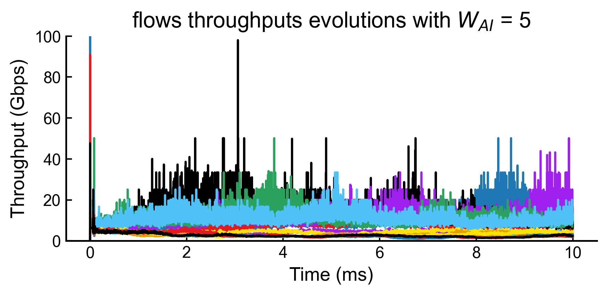
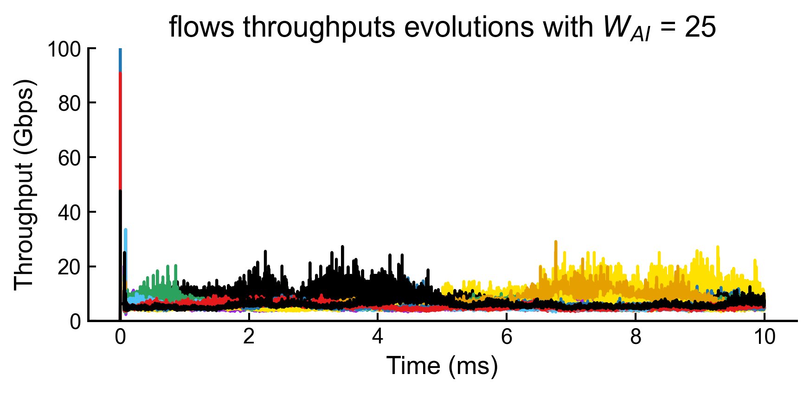
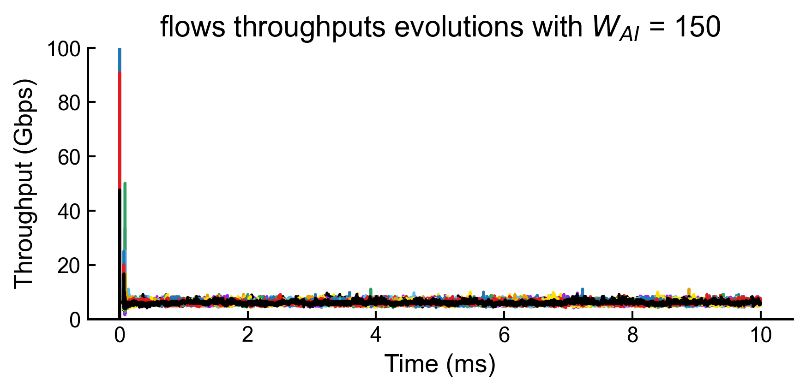
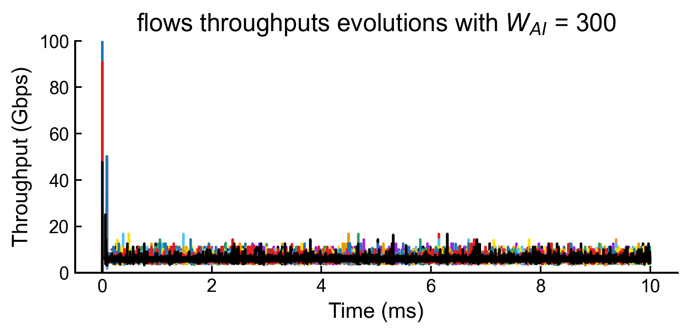
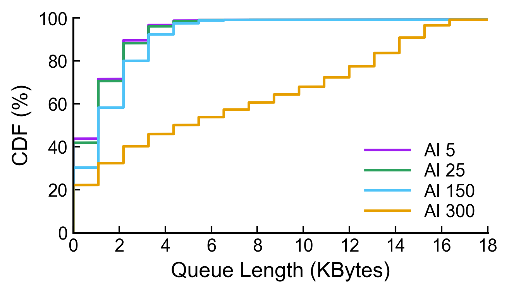
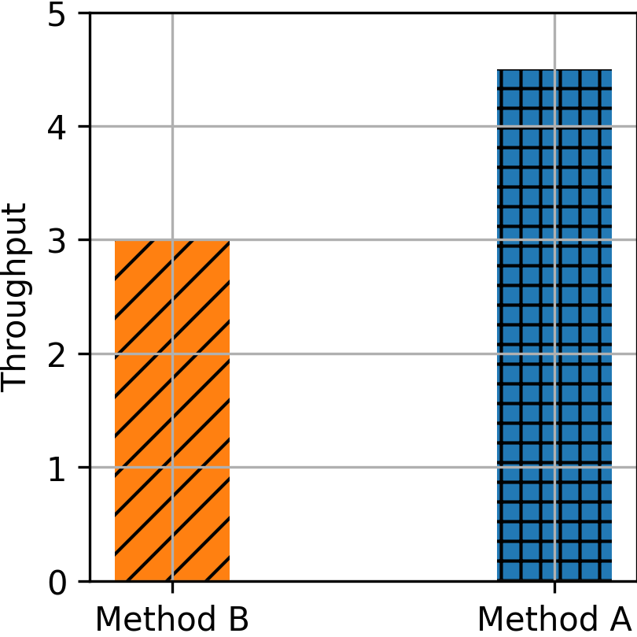
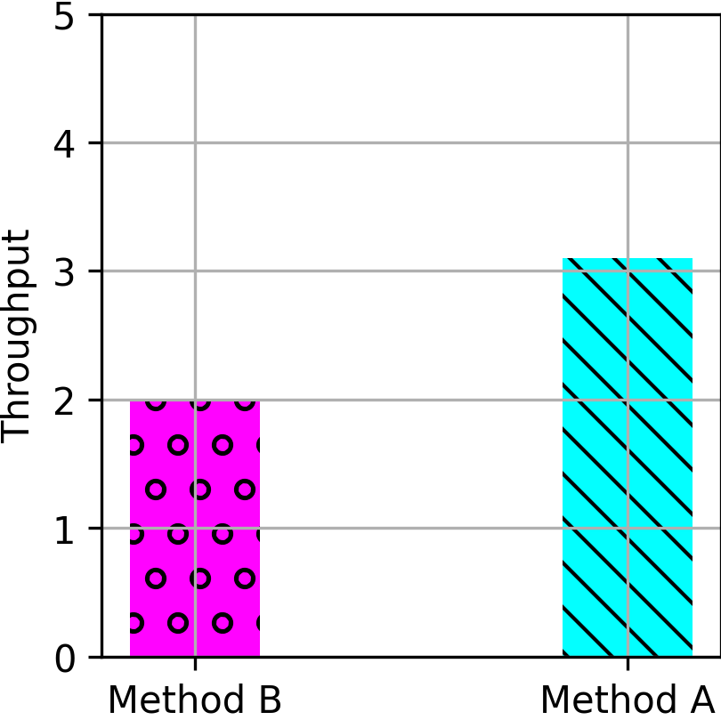

# Replicating: HPCC: High Precision Congestion Control

**Team Members:**  
Andrea Bellani ([andrea1.bellani@mail.polimi.it](mailto:andrea1.bellani@mail.polimi.it));

Andrea Migliorini ([andrea1.migliorini@mail.polimi.it](mailto:andrea1.migliorini@mail.polimi.it)).

---

**Source Paper:**

Y. Li, R. Miao, H. H. Liu, Y. Zhuang, F. Feng, L. Tang, Z. Cao, M. Zhang, F. Kelly, M. Alizadeh, M. Yu: HPCC: High Precision Congestion Control. In SIGCOMM '19, August 19–23, 2019, Beijing, China, © 2019 Association for Computing Machinery.

**Project:**
[link to our repository](https://github.com/ImAndreaBellani/NC-Project-2026)

---

# 1. Introduction

HPCC: High Precison Congestion Control presents a novel approach to Congestion Control for Datacenter networks. In particular, it is a window-based Congestion Control algorithm designed for high-speed RDMA networks that leverages INT-MD (*In-band Network Telemetry - EMbed Data*) to get precise queue lenghts information.

In the paper, authors explain the motivation and theoretical foundations behind HPCC, its design and test its effectiveness with both testbed and NS-3 simulations, comparing it with state-of-art other Congestion Control algorithms for Datacenter Networks.

## 1.3. HPCC main contributions
The main contribution of the paper is the leverage of INT to improve the Congestion Control on large-scale and high-speed networks. The paper present a detailed description of the in-production Congestion Control mechanism running in the AliBaba Group datacenters, which can provide insights for the design of new cc mechanisms that leverage INT (which was not leveraged by other state-of-art CC mechanisms).

Moreover, the paper also shares AliBaba production experiences on the difficulties to operate on RDMA networks with the state-of-art CC mechanisms and clarifies the challenges of designing a Congestion Control algorithm for RDMA networks. 

## 1.2. Challenges in achieving High Precision Congestion Control for RDMA applications

### 1.2.1. RDMA networks in Datacencter

The demand of high-speed Datacenter networks is driven by two main trends, according to both state-of-art and authors experience:
- new *resource disaggregation* and *heterogeneous computing* architectures require both low network latency levels and high network bandwidth;
- new applications (eg. large-scale ML training on high computation speed devices) that periodically trasfer large volume data with super-fast storage and computation speeds, often making the network the real performance bottleneck.

To sustain these requirements, new approaches started to offload network stacks into hardware. Authors, in particular, started to deploy large-scale networks with *RDMA* (Remote Direct Memory Access) over *RoCEv2* (RDMA over Converged Ethernet Version 2).

### 1.2.2. Why designing a new Congestion Control algorithm

HPCC tries to cope with the foundamental challenges authors have experienced with RoCEv2 and overcome limitations of other state-of-art Congestion Control mechanism.

Authors highlight that in RDMA networks:
- many flows starting at line rate causing severe congestions and deep packet queueing;
- preventing PFC pauses, since they can cause huge traffic drops;
- short flows experiencing really long latency due to deep packet queueing.

To tame the problems mentioned above, an adequate Congestion Control mechanism is essential however, state-of-art CC algorithms (such as DCQCN and TIMELY) face important limitations, such as:
- slow convergence of iterative methods that leverage coarse-grained feedback signals (eg. ECN);
- techniques inherently based on mechanisms that wait queues build-ups (eg. ECN marking or detecting RTT increasing) to adjust sender rates;
- complicated parameter tuning due to an high number of parameters or laking of simple rules of thumb to set them.

Authors highlight how these limitation are a consequence of the heuristics implented to adjust sender rates accordingly to current network utilization. On the other side, HPCC overcomes these limitations leveraging INT, which enables senders to continuosly and precisely computing network utilization.

## 1.3. How HPCC works

  
  
<b>Figure 1: The overview of HPCC framework</b>

The main keypoint of HPCC is the usage of INT-MD (*In-band Network Telemetry - EMbed Data*) to obtain precise link loads in particular, each switch in the path enqueues an INT header that contains various information which sender can use to proactively adjust its sending rate (eg. Queue Length). Instead of relying on heuristics or iterative approaches, senders receive a per-ACK updates to rapidly adjust the sending window, with a minimal set of algorithm's parameters.

When a new ACK arrives, the sender computes the current network utilization $U$ using information retrived from the INT headers collected over the flow path and updates its window. In particular, we can distinguish two different phases in the HPCC algorithm (names are invented by us to easily distinguish them):
- *agnostic phase* : the sender updates its window regardless of network utilization $U$ (tough it stills keeps calculating $U$);
- *adaptive phase* : the sender adapts its window adjusting it of a factor $\frac{\eta}{U}$ (note that if $U<<\eta$ the window increases, which is fine since the network is not congested).

Senders normally start in the agnostic phase and pass to the adaptive one after a certain number of RTTs or if $U\geq\eta$.

Instead of directly updating sending window starting from the previous value, sender always adjusts its window from what we can call a *reference window* $W^C$ that is updated nearly every-RTT (to be more precise, it is updated only when the ACK of the first packet sent from the last $W^C$ update is received). This technique is implemented to ensure what authors call *fast reaction without over-reaction*. In other words, it is essential that the sender quickly reacts to changes (so, every-ACK received), but adjusting its window completely at every ACK received is ... because ... (mettere la cosa che tutte le code sono diverse ogni RTT). So, the window adjustment is performed at per-ACK starting from a reference window ($W^C$) that is updated nearly every-RTT.

Note that HPCC requires just $3$ parameters to be configured, which meaning is quite easy to understand:

  <table>
    <tr>
      <th>Parameter</th><th>Meaning</th><th>How to set it</th>
    </tr>
    <tr>
      <th>$\eta$</th>
      <td>Network utilization threshold that triggers the adaptive phase</td>
      <td>Nearly to $0.95$, depening on how critical the </td>
    </tr>
    <tr>
      <th>$W_{AI}$</th>
      <td>Additive Increase window to ensure fairness</td>
      <td>Rule of thumb: $W_{AI} = \frac{W_{init}\times(1-\eta)}{N}$, where $N$ is the (maximum) number of expected concurrent flows on a single link</td>
    </tr>
    <tr>
      <th>$maxStage$</th>
      <td>Number of maximum stage before passing to the adaptive phase</td>
      <td>Generally low</td>
    </tr>
  </table>

# 2. Selected Result
## 2.1. Fairness and queue size with $W_{AI}$

Authors investigate the effect of different choices of $W_{AI}$ by simulating a 16 to 1 incast within a single rack. Properly understanding how to tune $W_{AI}$ is important to ensure fairness while maximizing the aggregated throughput. Authors then provide a simple rule-of-thumb to set it: $W_{AI} = \frac{W_{init}\times(1-\eta)}{N}$, where $N$ is the (maximum) number of expected concurrent flows on a single link.

Therefore, for a 16 to 1 solo-incast, considering $\eta = 0.95$ and $W_{init} = 100 Gbps \times 4\mu s = 50 KB$ leads to $W_{AI} \approx 156 B$. As a consequence, we expect that different $W_{AI}$ settings affect negatively algorithm performances.

  
  
<b>Figure 2: Fairness and queue lengths with $W_{AI}$ considering a 16 to 1 incast analyzed in the first $10\ ms$</b>

We see from Figure 2 that:
- a $W_{AI}$ set to a value really lower than the one suggested by the rule of thumb leads to a noticeble imbalance among flow throughput, which we can see as an "unfair" behavior as gives more bandwidth to some flows and a lower aggregated average throughput;
- a $W_{AI}$ set to a value really higher than the one suggested does not impact fairness but introduces higher tail-queue lengths and a slightly lower aggregated average throughput, which is less desirable.

In conclusion, as a less complicated set of parameters to tune is one of the challenges of CC algorithms that HPCC tried to tame, from these results we can say that the simple rule of thumb identifies a good trade-off between queue lengths and fairness.

## 2.2. Comparison of HPCC with other state-of-art CC algorithms (NS-3 simulations)

  
  
<b>Figure 3: FCT slow down at 95-percentile, PFC and latency with FB_Hadoop (30% avg.load + 60-to-1 incast and 50% avg.load)</b>

In order to properly understand how HPCC behaves compared to other CC algorithms the authors decide to simulate the behaviour of various other cc algorithms used in RDMA plotting them based on flow completion time, latency and pfc pauses using widely accepted and publicly available data center traffic traces (in this case, FB_Hadoop).
This clearly illustrates how much faster HPCC completes smaller flows than the other algorithms, with no PFC pauses, and lower latency compared to the others.
thus accomplishing the stated goals of preventing PFC pauses and lowering the latency of packets.

<!--
## 2.3. Different ways of reacting to ACK.

  
  
Considering an incast of 16 flows, Figure 13a and Figure 13b shows respectively the aggregated throughput and Queue Length running HPCC with different reacting policies

-->

# 3. Environment Setup
## 3.1. Hardware Environment
We ran the ns3 simulations and plot generations on a custom-built workstation with the followings HW specifications:

| Component | Specification |
|-----------|--------------|
| **CPU** | AMD Ryzen 5 7600X 6 core/12 threads at 5.4GHz |
| **Memory** | 32  GB DDR 5  4800 MHz |
| **Storage** | 1  TB NVMe SSD| 

## 3.2. Software Environment

| Component | Specification |
|-----------|--------------|
| **OS** | WSL Ubuntu|
| **Kernel version** | v24.04 |
| **NS-3 Compiler** | GCC v4.8 |
| **Python (NS-3 scripts)**  | v2.7.18 |
| **Python (performance evaluation scripts)** | v3.12 |
| **NS-3 Version** | v3.17 |
| **Paper artifact commit hash** | `9f4be2a9ead8a90e8bf732c66bd758c00e58e5be` |

## 3.3. Configuration Parameters
### 3.3.1. Network topology
We ran our experiments on two different topologies:
- for section 4.1. experiments we rebuilt the topology used in HPCC section 5.4.
- for sections 4.2. and 5. we used the fat-tree topology described in `simulation/mix/fat.txt` (which is also the one used in HPCC section 5.1)
### 3.3.2. Traffic generation
- for section 4.2 and 5.2 we generated the flows with a custom script `traffic_gen_incast.py` passing `-c <DISTRIBUTION_FILE> -n 320 -l <LOAD FRACTION> -b 100G -t 0.02` (which are, regardless of `-t`, coherent with the ones described in HPCC section 5.1.) while for flows with incasts passing `-c <DISTRIBUTION_FILE> -n 320 -l <LOAD FRACTION> -b 100G -t 0.02 -i 1 -p 2` (`-i 1` enables incast generation and `-p` details the incast percentage);
- for section 4.1 we written explictly the flows (see section 3.4.).
### 3.3.3. Simulation parameters
- we always ran the simulations with `run.py --cc <ccAlgorithm> --trace <Flow> --bw 100 --topo <Topology> --hpai <Rate_AI> --enable_tr 1` without any changes to the default algorithm configuration files.

## 3.4. Deviations from the Original Setup
We produced our experiments with no Software version differences according to the one described in the Paper artifact however, some deviations have been adopted for complexity or lack of information reasons.
### 3.4.1. Deviations for unavailable components or information
| Deviation | What is missing in the paper/artifact | What we chose |
|-----------|------------------------------|---------------|
| **PFC pauses evaluation** | It is not stated how the fraction of pausing time is calculated (i.e. by summing the puasing time of each interface or calculating just the time fraction the simulation was affected by at least one pause) | We calculated both the number of pauses verified in the simulation and the overall time each interface has been paused |
| **16 to 1 incast flow file** | The file was not already  present in the artifact | We wrote it accordingly to the required format |
| **$W_{AI}$ convertion from bytes to rates** | Paper always states $W_{AI}$ as a Byte value (i.e. window size) but artifact always specifies it as a rate | We converted it according to `Rate_AI` $=\frac{W_{AI}}{RTT}\times 8$, $[RTT] = \mu s$|
| **Throughput and queue lengths evaluation**  |  Artifact did not include any script for evaluating queues lengths or throughput from L3 traces | We implemented a script to calculate them (see section 4.1.). 
| **Start time of the $W_{AI}$ fairness evaluation** | The paper does not specify any period before actually evaluating the experiment of figures 14a and 14b | We started to evaluate the traces after $20\ \mu s$ (i.e. $5\ RTT$s) |
| **End time of queue lenghts observation for $W_{AI}$ fairness evaluation** | The paper does not specify clearly the end time of the queue length analysis in figure 14b | We put it a $10\ ms + 5RTT$ |
| **Latency evaluation** | Artifact did not include any script for evaluating end-to-end latencies from L3 traces | We implemented a script to calculate them (see section 4.1.).
| **Generation of flows with random incast** | the paper establishes in 5.3 how they reproduced the incasts events but doesnt establish what does it mean by "network capacity" nor offers a program to create the flows | we create a new version of `traffic_gen.py`: `traffic_gen_incast.py`. This script uses a Poisson distribution based on the probability of a single server being the receiver of a incast event to generate these events.|
### 3.4.2. Deviations for complexity reasons
The length of the traffic established of $0.1s$ generated in simulation hundreds of GBS of traces, so we reduced the traces to ($0.02s$) this  reduced the size while still mantaining statistical significance, with traces still the size of around $50 GBs$.

# 4. Experiment Result
## 4.1. Fairness and queue size with $W_{AI}$ reproduction
In order to reproduce results shown in HPCC figures 14a and 14b we first gerated all L3 traces of an in-rack incast 16-to-1 for the four $W_{AI}$ values, then we plotted throughputs and queue length percentiles of the only queue that was affected by the incast (any other queue had always zero length). As mentioned in section 3.4.1., we calculated average throughputs and queue length's percentiles with an ad hoc script we implemented.

Considering the deviations mentioned in section 3.4.1. we analyzed both queue lengths and throughputs between  $20\ \mu s$ (i.e. $5\ RTT$s, for the topology considered) and $10.02\ ms$, since starting from $0\ \mu s$ lead us to 99-pcts (for $W_{AI}=5,25,150$ near $17 KB$) which we seen as consequences of the extremely high peak of in the queue lengths near the beginning of the simulation. Note that $20\ \mu s$ is the standard duration of the agnostic phase with $maxStage=5$ (as it is set by default).

Queue lengths are counted just by looking to the parameter in the L3 traces and instant throughput is calculated as $\frac{tr.size}{last\_time - tr.time}$ (where $last\_time$ is the time of the last throughput measurement for that flow and $tr.size$ is the packet size) each time a packet arrives to the destination node. Then, to estimate the average throughput of a flow from the collection of the instant measurements, we held each sample until the next one and sampled each collection every $1\ \mu s$ (as HPCC paper does for Queue Lengths).

  
  
<b>Our reproduction of HPCC figures 14a and 14b</b>

Although results are quite similar to the ones shown in section 2.1., some small differences need to be pointed out:
- from HPCC figure 14a, the $W_{AI}=5$ stack was a bit lower than the one for $W_{AI}=25$ however, the differences in fairness is still so evident and other stacks heights are much more similar to the ones shown in the paper;
- 95-pct and 99-pct for $W_{AI}=300$ are slighty higher than the paper ones (from paper figures, nearly $1.5\ KB$ of difference).

To better validate the coherence of our results w.r.t. to the L3 traces we generated from NS-3, we also plotted flows throughputs evolutions and Queue Lengths CDFs:

  

    
  

  

    
  

  

    
  

  

    
  

  

    
  

## 4.2. Comparison of HPCC with other state-of-art CC algorithms (NS-3 simulations) reproduction

To reproduce figure 11 from the paper we had to create a system capable of generating realistic incast events across servers of the topology. In the paper they establish it’s a 60 to 1 incast of 500kB, so an incast event is 60 new flows of 500kB. We had to discover separately that a 2% load of the network capacity was then n-servers*NICbw*0.02.
We decided to use a Poisson distribution based on the expected number of incasts on a single server so that across 320 servers on 100Gb NICs and the 2% load stated we expected to see 2667 events over a which corresponds to 320*NICbw*0.02/60*500KB, validated experimentally by generating 10 flows with this script.
Once the script was validated we generated 2 flows with the distribution FB_Hadoop with the parameters generally established in 3.3.2. one with incast enabled and at 30% load and one with incast disabled and 50% load.
We then simulated the behaviour of the cc algorithms represented in the paper, as this process is single core based this process will usually take hours on our homebuilt pc.
After completing the simulation we used the fct_analysis.py and the trace_reader.cpp.
The fct analysis result corresponded quite well to the results shown by the paper, despite the smaller sample size. The latency analysis was done by extracting the 5 most common pair of servers in the first million lines and then evaluating their average latency between them across the entire trace. We experimented with picking 50 random traces but it didn’t correspond well to the results in the paper. Since no script was provided in the artifact to calculate the end-to-end latencies we implemented a one ad hoc. Simply, first traces are analyzed to detect which is the residence node of each server, then end-to-end is calculated as the time need to for the packet to traverse the network from the source node to the destination one

With the PFC pauses instead we have had to determine what the authors actually meant by fraction of PFC time, as no clearly definition was given. So, in order to obtain still relevant result for the paper question (i.e. measuring the PFC impact running each CC algorithm) we plotted both the number of PFC pauses verified during the simulation and the total amount of time interfaces passed in pause (i.e. the sum over all interfaces of the total amount of time each has been in pause). NS-3 artifact implementation already provides the report of PFC pauses and resumes events by interfaces, so counting them and evaluating their duration was pretty trivial.

> Explain how your experiment was conducted and then what results you acquired. 
Afterwards, compare your results with those of the paper and state your
takeaways.

Step-by-step description:

1. Execution procedure
1. Measurement method
1. Number of runs
1. Statistical treatment (mean, median, CI, etc.)

Also Describe:

- How did you ensure correctness (did you check also other metrics to make sure the experiment is running correctly?)
- Did you do any debugging? Discuss issues you faced and how you overcame them (if applicable consider allocating a subsection for this item) 

Share your result and compare them with the paper's. Then discuss your takeaways.

For comparison include:

- Graph(s) or table(s)
- Matching axes and units with the source paper
- Error bars if applicable
- You may want to report difference with the original results (e.g., absolute
number or percentage).

For example:

  

    
    
Figure 2: The figure shows that method A improves throughput compared to method B

  

  

    
    
Figure 3: Our reproduction of Figure 1 shows results with the similar trend as claimed by the paper

  

> **Reminder:** the goal is not achieve the exact results of the paper, but to do a rigorous experiment with similar assumptions from the source paper and gain insight. The insight can be correctness of work, failure to reproduce same results, or even infeasibility of doing such experiment for interesting reasons.

# 5. Further Exploration

In this project you are required to also explore a research question of your own. Either:

1. Take the same test with different input workload or a variation of a test that is not present in the paper and comment the results you obtain
1. Implement a new feature on top of the system you evaluated and show a figure showing the performance

Discuss which approach you take, and what you explored. Explain what was your
motivation and importance of your question.

## 5.1. Methodology and Result

Report the experiment you designed for answering the question and share the
result you got.

Include:

- Graph(s) or table(s)
- How the experiment was conducted (share the details)
- What did you discover?

# 6. Reproducibility Assessment of the Paper

Evaluate the paper itself:

- Was the methodology clearly described?
- Was the artifact usable?
- How difficult was reproduction?

## 6.1 Paper evaluation

## 6.2 Replication Package evaluation

# 7. Conclusion

Conclude the report by mentioning the takeaways of experiments you did

---